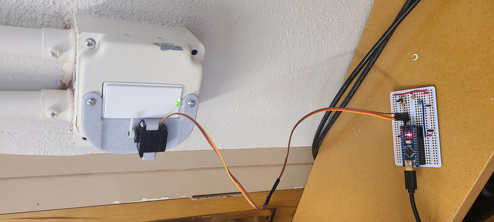
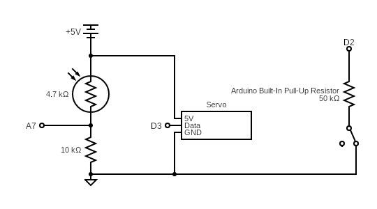
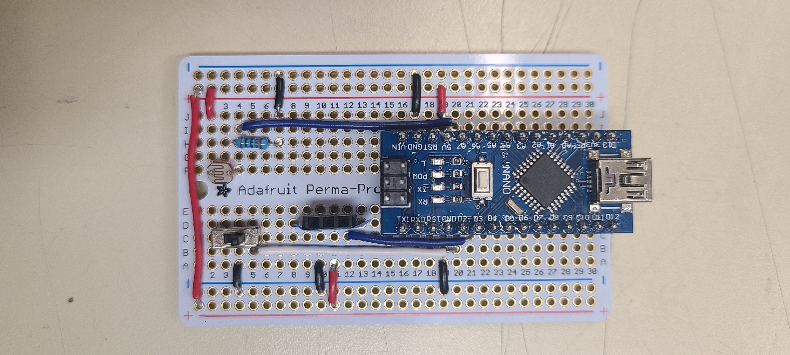

# Lightomatic-3000

The Lightomatic-3000 is a state-of-the-art "robot" (in the loosest sense of the word) that keeps lights from dimming/turning off due to poorly calibrated presence/ambient lighting systems.

  

## The Problem: Got a light?

The lighting system in a particular building has an energy saving feature that dims and turns off the light if:
- the ambient light is above a certain threshold
- no motion has been detected for a certain amount of time

Unfortunately, the ambient light sensor seems to be miscalibrated or mounted in a location not representative of the actual ambient light in the room it controls, causing the lights to dim/turn off in the middle of the workday. Dim lighting conditions in offices can lead to significant eyestrain and decreased productivity.

Additionally, the motion detector will also fail to detect the presence of people working on their computer at night, causing the lights to go out and requiring someone to grope in the dark to find the light switch, which is not ideal.

## Enter the Lightomatic-3000

The Lightomatic-3000 is a simple, lightweight, and cost-effective way to keep the lights on. 

### Photoresistor

It uses a photo-resistor to sense the ambient light in the room. By setting thresholds for lights dimming and off, it can differentiate whether the lights are just beginning to dim, or if they are fully off. Note that the thresholds will vary depending on resistor value and photoresistor, so additional retuning may be necessary if those parts are replaced.

### Servo for Button Pressing
Once it detects the lights are beginning to dim or have turned off, it actuates a servo to press the light switch. 

- If the lights are dimming but not off, it will double press the light switch to turn the lights off and on again at full brightness. 
- If the lights are fully off, it will single press the light switch to turn the lights back on. 

### Enable/Disable Switch (Optional)
It also features an optional switch that can be used to enable/disable the system when you do want to keep the lights off.

## Parts Needed
- Arduino + USB power
- 5V servo (3.3V would work)
- photoresistor
- Resistor (10k ohm)
- SPDT switch (optional)
- Mounting method (Tape or 3d printed mount)

## Assembling

1. Wire up the circuit below either using a breadboard or a protoboard.
2. Check:
- Photoresistor values are being read correctly. (Also a good time to check threshold values.)
- Servo actuation when it is dark enough. (Also good time to check servo angle is enough to press the switch without breaking anything.)
3. Flash the code in the `lightomatic3000` folder onto the Arduino and unplug.
4. Mount servo to light switch.
5. Plug arduino in
6. Let there be light!

## Circuit Diagram

## Some Photos

### Assembled Protoboard

 